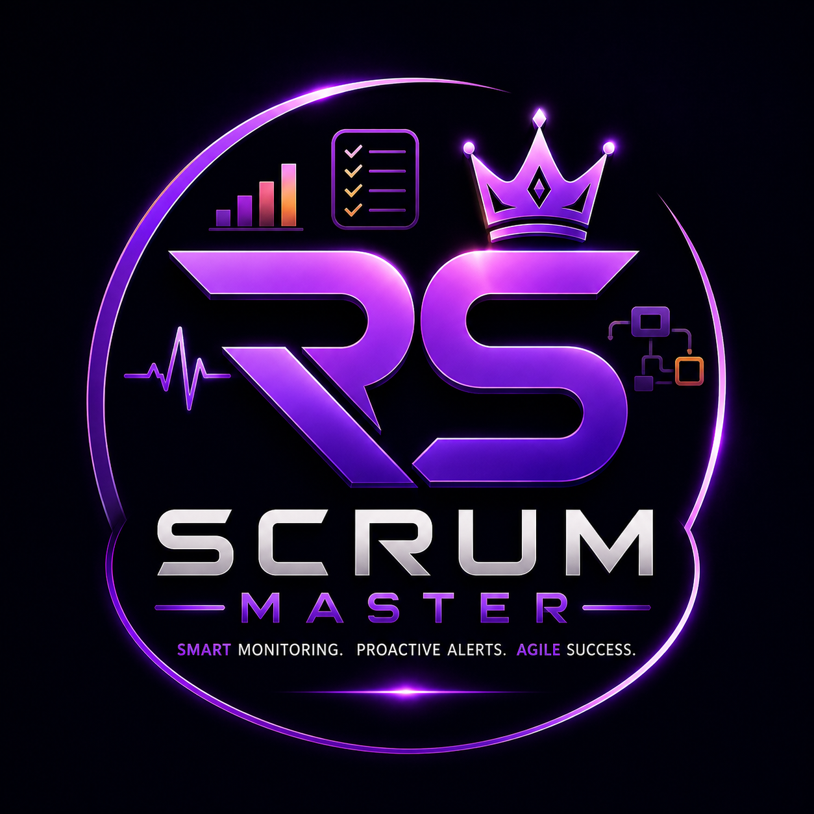

<div align="center">
  
</div>

# Scrum Master

Scrum Master is a centralized project-management and monitoring platform that allows users to connect multiple hosted software projects and later monitor their health, analytics, errors, API performance, feedback, notifications, and other operational information from one dashboard.

## Phase Progress & Current State

This repository contains implementations across multiple phases:
- **Phase 1 & 2**: Foundation, Multi-tenant database, SaaS UI, and Monitoring Engine.
- **Phase 4 & 5**: Error telemetry, Analytics, Operational Feedback, and Notification systems (Completed).
- **Phase 7**: Subscription detection, Members & Access Control, and multi-project workspaces (Completed).

## Technology Stack

**Frontend:**
- React (Vite)
- TypeScript
- CSS Modules (Vanilla CSS)
- Zustand (State Management)
- Lucide React (Icons)
- React Router

**Backend:**
- Python (FastAPI)
- Motor (Async MongoDB Driver)
- Pydantic
- PyJWT (Authentication)
- Uvicorn

**Database:**
- MongoDB (Atlas recommended)

## Repository Structure

```
scrum-master/
├── frontend/             # React application
│   ├── src/
│   │   ├── components/   # Reusable UI components
│   │   ├── pages/        # Dashboard, Projects, Setup pages
│   │   ├── services/     # API clients
│   │   ├── stores/       # Zustand state
│   │   └── index.css     # Global design system variables
├── backend/              # FastAPI application
│   ├── app/
│   │   ├── api/          # Route handlers
│   │   ├── core/         # Config, Security (JWT)
│   │   ├── database/     # MongoDB connection layer
│   │   ├── models/       # DB Schemas
│   │   └── schemas/      # Pydantic models
```

## Local Development Setup

### 1. Database Setup
1. Create a MongoDB database (locally or MongoDB Atlas).
2. Note the connection URI.

### 2. Backend Setup
1. Open a terminal in the `backend/` directory.
2. Create a virtual environment: `python -m venv venv`
3. Activate it: 
   - Windows: `.\venv\Scripts\Activate.ps1`
   - Mac/Linux: `source venv/bin/activate`
4. Install dependencies: `pip install -r requirements.txt`
5. Copy `.env.example` to `.env` and fill in the values:
   - `MONGODB_URI`
   - `GOOGLE_CLIENT_ID`
   - `JWT_SECRET`
6. Run the server: `uvicorn app.main:app --reload`
7. API will be available at `http://localhost:8000`

### 3. Frontend Setup
1. Open a terminal in the `frontend/` directory.
2. Install dependencies: `npm install`
3. Copy `.env.example` to `.env` and fill in the values:
   - `VITE_GOOGLE_CLIENT_ID`
4. Run the development server: `npm run dev`
5. The application will be available at `http://localhost:5173`

## Authentication Setup

Scrum Master uses Google OAuth. To fully test login:
1. Create a project in Google Cloud Console.
2. Configure the OAuth Consent Screen.
3. Create OAuth 2.0 Client IDs for Web Application.
4. Add `http://localhost:5173` to Authorized JavaScript origins.
5. Place the Client ID and Secret in your backend `.env` file, and Client ID in frontend `.env`.

## Deployment

### Frontend (Vercel)
The `frontend/` directory can be deployed directly to Vercel as a Vite/React project.
Required Environment Variables on Vercel:
- `VITE_API_BASE_URL` (Point to your production backend, e.g., `https://api.scrummaster.rathenesh.dev/api/v1`)
- `VITE_GOOGLE_CLIENT_ID`

### Backend (Render)
The `backend/` directory can be deployed as a Python Web Service on Render.
Start Command: `uvicorn app.main:app --host 0.0.0.0 --port 10000`
Required Environment Variables on Render:
- `ENVIRONMENT=production`
- `FRONTEND_URL=https://scrummaster.rathenesh.dev`
- `MONGODB_URI`
- `JWT_SECRET`
- `GOOGLE_CLIENT_ID`
- `GOOGLE_CLIENT_SECRET`

## Future Phases
- Phase 3: Agent Integration (scrum-master-agent.js)
- Phase 4: Error telemetry & Analytics
- Phase 5: Feedback & Notifications
- Phase 6: Hosting integrations
- Phase 7: Subscriptions and Teams

## Monitoring Engine (Phase 2)

The monitoring engine executes real-time server-side checks without relying on the browser.
- **Scheduler**: A background `asyncio` task within FastAPI polls projects based on their configured `monitoringInterval`.
- **SSRF Protection**: Strict IP parsing prevents the backend from resolving and pinging internal networks (localhost, 192.168.x.x, etc.).
- **Incident Logic**: Incidents are automatically triggered after 3 consecutive failures (timeouts, DNS failures, or HTTP 4xx/5xx).
- **Data Retention**: Uptime is aggregated dynamically from raw check documents. (Further aggregations can be applied in later phases).
